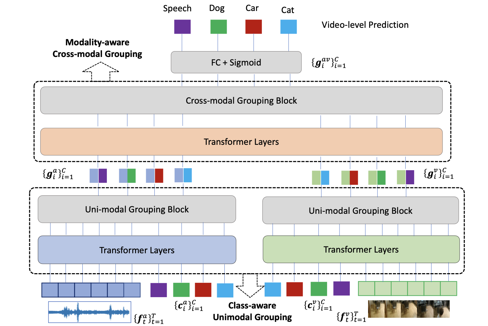

# Multi-modal Grouping Network for Weakly-Supervised Audio-Visual Video Parsing

Official implementation for MGN. 

MGN is a novel and lightweight baseline with explicitly semantic-aware grouping for weakly-supervised audio-visual video parsing.

[**Multi-modal Grouping Network for Weakly-Supervised Audio-Visual Video Parsing**](https://openreview.net/pdf?id=zfo2LqFEVY)
<br>Shentong Mo, Yapeng Tian<br>
NeurIPS 2022.

<div align="center">
  
</div>

## Environment

To setup the environment, please simply run

```
pip install -r requirements.txt
```

## Datasets

Data can be downloaded from [Unified Multisensory Perception: Weakly-Supervised Audio-Visual Video Parsing, ECCV 2020](https://github.com/YapengTian/AVVP-ECCV20)


## Model

A trained model **MGN_Net.pt** is provided for inference in **models** dir.


## Train & Test

For training an MGN model, please run

```
python main.py --mode train \
    --audio_dir path/to/vggish/feats/ \
    --video_dir path/to/res152/feats/ \
    --st_dir path/to/r2plus1d_18/feats/ \
    --model_save_dir models/ \
    --unimodal_assign soft --crossmodal_assign soft \
    --epochs 40 \
    --depth_aud 3 --depth_vis 3 --depth_av 6
```

For testing, simply run

```
python main.py --mode test \
    --audio_dir path/to/vggish/feats/ \
    --video_dir path/to/res152/feats/ \
    --st_dir path/to/r2plus1d_18/feats/ \
    --model_save_dir models/ \
    --unimodal_assign soft --crossmodal_assign soft
```

## Citation

If you find this repository useful, please cite our paper:
```
@inproceedings{mo2022multimodal,
  title={Multi-modal Grouping Network for Weakly-Supervised Audio-Visual Video Parsing},
  author={Mo, Shentong and Tian, Yapeng},
  booktitle={Advances in Neural Information Processing Systems},
  year={2022}
}
```
